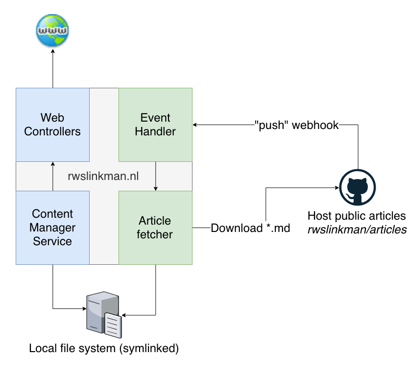
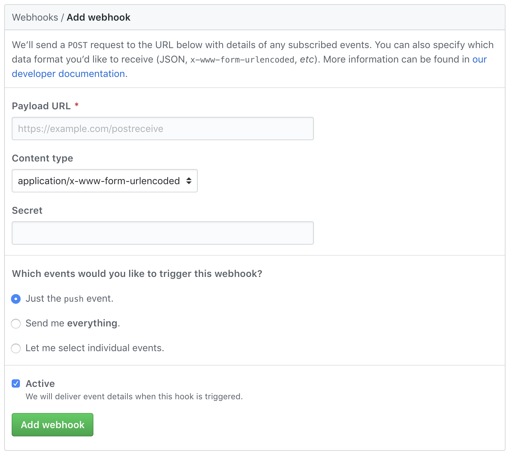
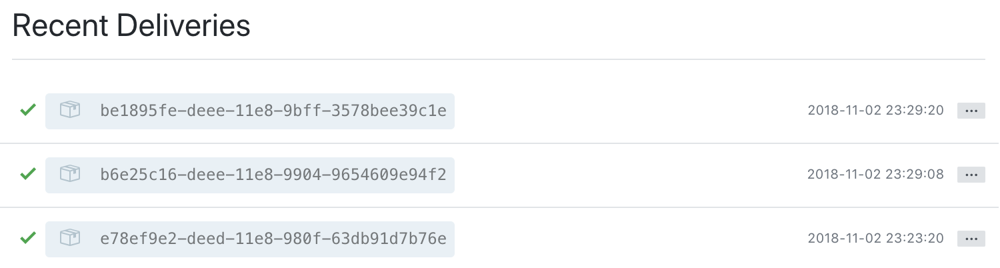

# Hello world!

Hi there!  

It seems you've found your way to my first article.  
Recently I have been thinking about writing articles for my website.  
You could call it a tech blog, but that would sort of suggest that I write on a regular basis about the tech industry.  
Maybe you could call it a "captain's log" for a software engineer, but that just sounds crazy, right?  
I've decided to keep it simple and call it "Articles".  
  
Here I will be writing about all the cool stuff I learn as a software developer.  
Since I wrote my first line of code, I have been in love with creating software.  
And I have been learning about it ever since...  

My first bit of code was a simple PHP website for a highschool project. Simple, but fun.  
Now, being a software professional, I still really enjoy building software.  
Way more complex, ofcourse, but as fun as the first day.  
In my free time, I still do some hobby coding on way too many pet projects.  
Being able to work on a variety of cool projects, gives me the opportunity to learn a lot.

There's so many things I've learned, that I already forgot some of those.  
And that's a shame, you'll surely agree.  
Here is my way to document my learnings.  
Practical for me, (hopefully) useful for you and probably good laughing material in a few years.  
You can expect reviews and example projects of tools I work/play with and sometimes I like to write more of a "developer story", if that makes sense.  

I will be writing these articles on GitHub on a feel-like-it basis and they will be displayed on my website!  
Visit [my website](https://rwslinkman.nl) if you're not already there :)  

_Great stuff, but I thought this was about tech and software?_  
Yes, so I'll tell you about the feature I built into my (customly built) website to display my articles.  

## Articles feature
How I built a Markdown display tool with PHP on my website.  

### A little introduction
When I studied computer science, I had a student job as a PHP developer.  
We built all kinds of websites for small to medium size companies in the area.  
I decided to build myself a website, since that would look cool on my CV.  
So I did, in PHP, ofcourse.  

My project has started in 2013 and is built on the Symfony framework, version 2.3 at that time.  
Ever since, I have been upgrading and it is currently one of the latest versions.  
Professionally, I do not work on PHP projects anymore, but I still enjoy writing PHP.  
The newest upgrade of my website will be the Articles feature.  

### First thoughts
Since Markdown became a thing in open source software projects, I've found it easy to use.  
For that reason I thought it would be a good idea to write my articles that way.  
Considering my articles were going to be published anyway, I might as well store them on GitHub.  
They have a brilliant Markdown editor that I can use to my advantage.  

I also considered building an editor into my existing website.  
But why re-invent the wheel? GitHub's solution is great and well usable.  
It did give me some new questions about how my website would display them, however.  

For example:
- How to convert Markdown to HTML for displaying?
- Will my articles be updated when I changed them or write a new one?
- Can I choose which articles to "feature" on my home page?
- Is this possible without complicated authentication systems?

### Solutions
Being notified on article updates from GitHub was pretty easy.  
I've had an account there for a while now and I noticed the `Webhooks` settings page before.  
Until now, I had never used it before.  This was a great opportunity to do so.  

GitHub is well documented so finding out how their webhooks work was not that hard.   
I found [this guide from GitHub](https://developer.github.com/v3/activity/events/types/#pushevent) themselves that explains what data you get from a `PushEvent` webhook.  
The interface that GitHub offers to configure a webhook is very easy to use.  
All I needed to do was to create an endpoint to handle the webhook. More on that later.  

I figured that I could download the `*.md` article files from GitHub to my PHP webserver.  
That way, I could prevent creating an extra hop to GitHub to read the requested article on my website.  
Also, it would allow me to have a cache of all articles I have and create an overview of them.  
So I thougth some sort of `ArticleFetcher` would be in place.  

Having an overview of all articles also offers the possibility to manage the articles.  
I designed a service that would be notified when the fetcher completes its job.  
In my admin panel, I would be able to update the article's visibility and other attributes.  
Lastly, I designed some `Controllers` to handle HTTP requests and show the articles. 

On a pratical note, I still had no idea on how to parse Markdown into HTML.  
I did some research and finally found [this great library](https://github.com/erusev/parsedown) that does all the heavy lifting for me.  
Parsedown does a line-by-line parsing and returns separate HTML lines.  
This is ofcourse something I could work with!  

With this information I drew my feature architecture and started building.  
I'll discuss the tools and techniques I have used to build this.  
The complete image looks a little like this:


### Webhooks
GitHub offers a very nice interface to configure webhooks per-repository.  
It took me only a few seconds to create one.  
You just fill out their form in the `Settings` menu in your repository.  

 

There is a field where you can enter a password that GitHub will use when calling you.  
This can be used to prevent unwanted webhook triggers.  
You'll find the password, in an encrypted format, in the `X-Hub-Signature` header.  
In the headers, you will also find `X-GitHub-Delivery`, an ID that you can refer to on the GitHub website.  
Lastly there is the `X-GitHub-Event` event type header.  

After setting up your webhook, you can make GitHub send a test event to your webhook.  
That's really great, because you can immediately see you webhook work!  
Here's an example of how the delivery log looks:  

 

I built a very simple `Controller` to catch the webhook and handle it.  
Here you can see the `ArticleFetcherService` that is called to fetch article data from GitHub.  
Also, I log a simple message about the webhook trigger in my logging system.  
Finally a simple `Response` object is returned, which is the equivalent of an empty `HTTP 200` response.

```php
class WebHooksController extends Controller
{
    public function githubArticlesHook() {

        /** @var ArticleFetcherService $articleFetcher */
        $articleFetcher = $this->get(ServiceEnum::ARTICLE_FETCHER);
        $articleFetcher->fetchArticles();

        /** @var LoggingService $loggingService */
        $loggingService = $this->get(ServiceEnum::LOGGING);
        $logMessage = "Web hook fired: GitHub Articles repository update notification";
        $logEntry = LogEntry::create(LogType::SYSTEM_NOTICE, LogSeverity::INFO, $logMessage);
        $loggingService->log($logEntry);

        return new Response();
    }
}
```

### Fetching articles
The GitHub API has a request limit, which means you can only query it so many times every hour.  
In the miraculous event my website would ever get an insane amount of traffic, that would mean lots of requests to said API.  
The first few requests would be able to read my articles perfectly fine, but the other ones would see nothing.  
This is something I wanted to avoid, so I decided to cache my articles on my webserver.  

Filling up the cache easier than expected, mostly thanks to the great [PHP GitHub API library by KnpLabs](https://github.com/knplabs/php-github-api/) I found.  
It offers a simple way of querying a GitHub repository and it's metadata.  
The `Repo` API made it possible to get information about all the files inside the repository.  
Using this, I could gather all the files I needed, like so:  

```php
public function getFilesMetadata($path = null) {
    $githubClient = new Client();
    /** @var Repo $repoApi */
    $repoApi = $githubClient->api('repo');
    return $repoApi->contents()->show(self::ARTICLES_REPO_OWNER, self::ARTICLES_REPO_NAME, $path);
}
```
The `$path` parameter allows to query subdirectories directly.  
When left at `null` it gets the repository's root diretory files.  

Using the same library, downloading file contents was very straightforward.  
The previous function returns the correct file paths, which you can use as follows:  

```php
public function downloadFileContent($pathInRepo) {
    $githubClient = new Client();
    /** @var Repo $repoApi */
    $repoApi = $githubClient->api('repo');
    return $repoApi->contents()->download(self::ARTICLES_REPO_OWNER, self::ARTICLES_REPO_NAME, $pathInRepo);
}
```

These functions are all used by my `ArticleFetcherService` that fetches the articles.  
It is has a `fetchArticles` function that gets called on every incoming webhook.  
The `ArticleFetcherService` lives in the service container, which is part of Symfony's `Kernel`.  
In every `Controller` and `Service` I am able to access the services that live there.  
This makes it easy to call such a service from basically anywhere in the application.  

Now that I have a filled "cache" with my articles, this brought a few issues to mind:  
- I know **when** articles are updated, but applying the changes using Git seems a bit too much. 
- Not exactly knowing **which** files have changed, means that **all or any** of them changed.  
- Files might be deleted and the `ArticleFetcherService` wouldn't find out.

Because of this, I implemented a "clean" fetch. All articles are downloaded newly every time.  
This saves me the effort of going through all the changes.  
Comparing images, that I will use to decorate the articles, is a difficult thing to do.  
I surely wanted to skip that in order to roll out the articles feature quickly.

The KnpLabs library downloads all files in the same way.  
It was therefor quite easy to build a recursive function to download assets in directories within the repository.  

### Reading articles
TODO - write about converting markdown to html

### To show or not to show  
TODO - write about article state management
