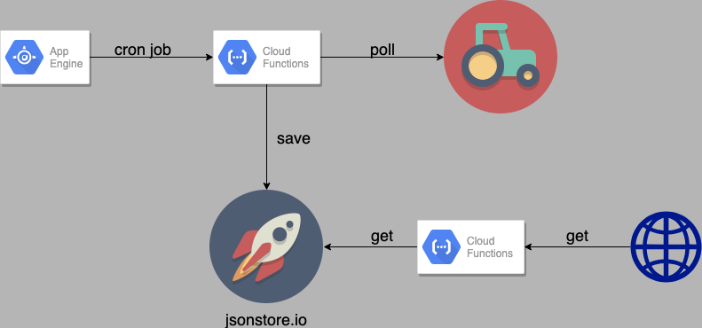
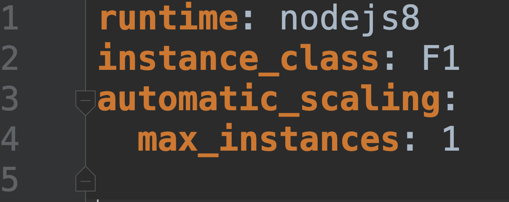
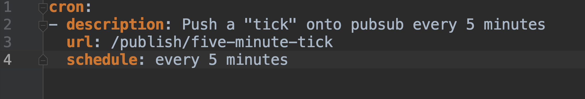
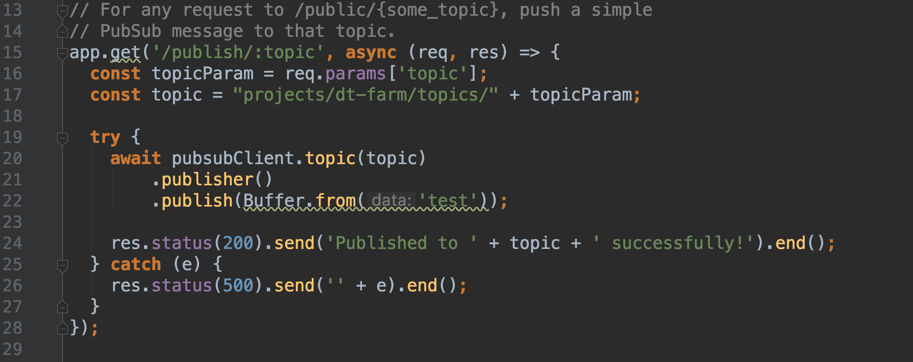
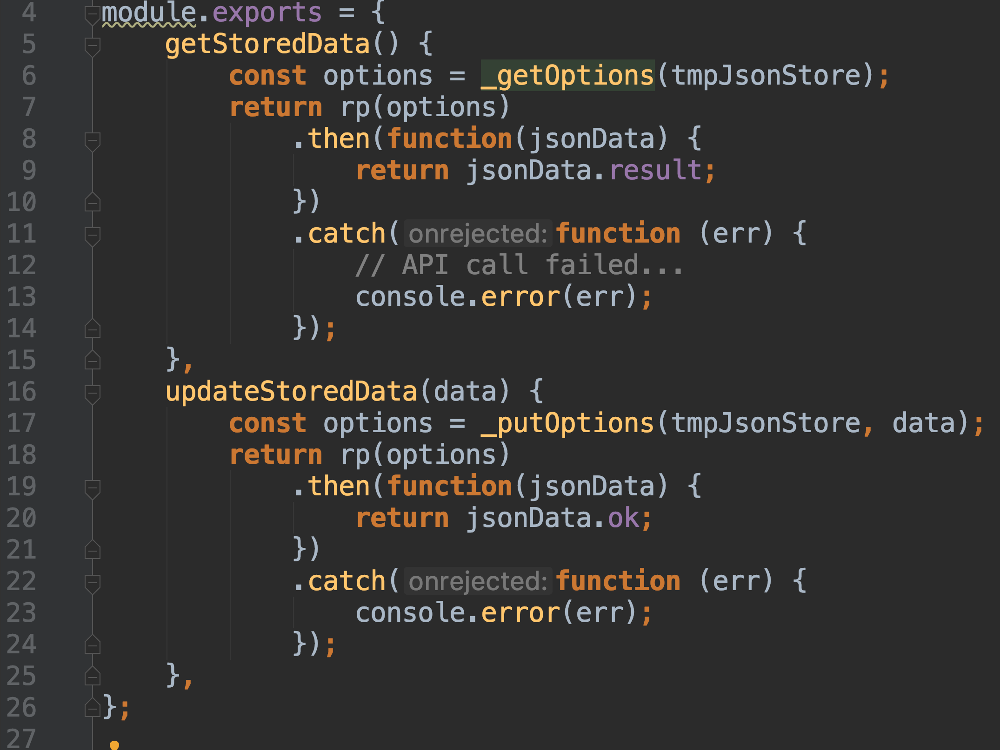
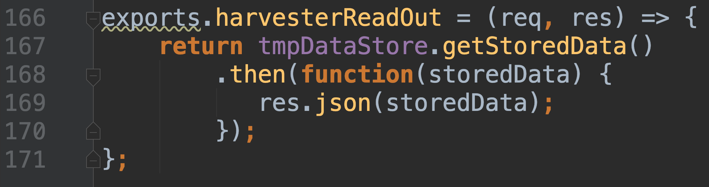

# Having fun with Farming Simulator and Google Cloud

// TODO Add links everywhere

Enjoying the work I do is very important to me.   
There always has to be a challenge in it, but having fun with colleagues is also a big factor.  
I love to dig deep into a subject sometimes to master it and teach other what I've learned.   
Not always though, because sometimes I really enjoy building useless software.   

At work we were recently discussing games and the possibility to play together.   
When they asked me about the games in my Steam library, I said "Well, amongst other things, I have **Farming Simulator**!"   
You should have seen the look on their faces.   
First they thought I was crazy, but to me it is a game that you can play without the pressure to "win".   
After a day of work I'm not in the mood for a shooter that gives you an adrenaline rush.   
I rather enjoy a *slow game* that really takes away stress.  
Farming Simulator is great for this and their latest edition [Farming Simulator 19](https://store.steampowered.com/app/787860/Farming_Simulator_19/) is a great piece of work!  


In the end, my colleagues got excited and also bought the game.   
We decided to rent a dedicated Farming Simulator server, so we could play together.   
The server is always online so even if the others aren't online, I can still farm the digital lands.   
It is password protected, so nobody can mess up the progress.   

Our farm currently has tractors of multiple manifacturers and we specialized in horses and forestry!    
We have a lot of fun riding the tractors and build up our farm together.   
The physics aren't super realistic, which brings a lot of fun sometimes.   
Driving a combine harvester off a cliff and then driving on like nothing is wrong, why not?


**not my screenshot*

##### Then we found something really cool
Our rented farm server comes with an administrator dashboard.   
It allows to configure some server settings, add mods to the game or restart the server.   
There is also an app for Android and iOS, which mostly has read-only functionality.   
At some point I was clicking through all the configurable options and really found a gem!

The server offers an endpoint that offers real time game statistics in XML or JSON format.   
Futhermore, there were PHP based plugins and libraries to read real time data and display it on websites.   
The API is most likely used by the mobile apps, but it was publicly accessible from the link in the admin panel.   
Clicking the link showed me XML output, but changing the URL a bit, I found that it would also return JSON!   
This is great, because it makes processing it easier.   
The only downside for me was that it does not collect statistics over time.   
It will return the current state of the server & who is online right now, but nothing to make cool dashboards out of.

### Harvesting data
So I set myself a goal. I wanted to harvest something more than digital grains to feed to my digital horses.  
Recently I have been getting more into the Serverless principle.   
For those who feel unfamiliar: the idea is that you just write the code and let your cloud provider care about hosting.   
You basically just code what it **does**, not necessarily **how** or **where**.   
A great example of this are *Cloud Functions*.   

Probably you have heard of [AWS Lambdas](https://aws.amazon.com/lambda/), [Google Cloud Functions](https://cloud.google.com/functions) or [Azure Functions](https://azure.microsoft.com/en-gb/services/functions/).   
You specify a trigger and the cloud will execute your *function* to handle it.   
Triggers could be many things, amongst others:
- HTTP requests
- A message appeared on a message queue
- Someone asked a question to your Google Home or Alexa app
- File uploads to your storage buckets 
- Database CRUD events

Whatever you can come up with, could be a trigger for your function.   
For my use case, I needed a way to build up history from a real time data API.   
Polling the API is definitely the way to go here.   
This could be perfectly set up with a cron job.   
Futhermore, it's by definition a background process, for which Serverless is very useful.   
All I want is to convert some farm data into my own data model.   
Translating data is a very good use case for Serverless, since you don't have to worry about the availability of the function.   

I considered setting up a Raspberry Pi to send HTTP requests to trigger my Serverless function.   
Running an external system to send triggers to function seemed very error prone, though.   
So is there a way you can run a cron job in the cloud?    
It would really offload a lot of work for me, which is nice for a basic pet project like this.   

I chose 5 minutes to be my cron interval and then I started thinking.   
Next, the idea is to call the Farm API, take whatever data I need and store it over time.   
Not being bothered to setup an actual database of file storage, I opted for [jsonstore.io](https://www.jsonstore.io/).   
It offers a very basic REST endpoint where you can store any JSON data you need.   
You are provided with an unique ID that you use in the HTTP calls to your jsonstore.   
There is no authentication available at jsonstore, so that means keeping your ID very secret!   
Although I am aware this is very bad in terms of security, this solution is alright, I plan to openly publish the statistics anyway.   

My full solution looks like the image below.   
It will involve a cloud cron ticker and a cloud function, combined with jsonstore.   



#### Setting up the cron ticker
With most questions, I am probably not the first person to come up with this question.   
People must have wondered before how to build a *cloud cron trigger* for whatever they want to do.   
Turns out I was right, because I found [this article](https://firebase.googleblog.com/2017/03/how-to-schedule-cron-jobs-with-cloud.html) from the people at Firebase.   
They explain how to set up an [AppEngine](https://cloud.google.com/appengine/) instance that does the work for me.  
It will send a basic message to a Google PubSub topic, which will trigger my function.  
[Google PubSub](https://cloud.google.com/pubsub/) is in essence Google's message queue alternative. It has a wide range of configuration and usage options.   

AppEngine is Google's compute platform in it's most basic form.   
They provide you with a machine of your choice in the cloud, you manage it yourself.   
It is not so much in line with the Serverless principle, since the AppEngine instance *is* the server.   
Still it offers great functionality at the scale you desire.   
My use case required really nothing but a cron job, so I chose the smallest scale available.

Configuring an AppEngine is very easy, assuming that you have the `gcloud` command line tools set up properly.   
To create an `app` in Google AppEngine, you just run the following command.   
You can find my `app.yaml` configuration below that keeps the instance scale to a minimum. 

```
gcloud app create
```

It has the smallest instance type and the smallest automatic scaling set up.   
I picked NodeJS 8 as the `runtime` so the AppEngine instance will have that automatically installed.   
After booting, it will look for an `app.js` file to run.   
Once it is found, it will be executed and you can run your NodeJS app from that point on!



Conveniently, AppEngine also has a very simple way of configurating cron jobs for AppEngine instances.   
You specify a `cron.yaml` file somewhere; I chose to put it in the project root, right next to `app.yaml`.   
The cron file is also picked up by the [Google Cloud Console](https://console.cloud.google.com) web interface.   
For multiple cron jobs, simply specify more entries to the array.   
My `cron.yaml` configuration looks like the screenshot below.   



The `description` property is only used by the Console to show you what the cron job is for.   
Google defined a basic timing format, an example is shown in the `schedule` property.   
The `url` property in the cron job points to a GET endpoint on **localhost**, the AppEngine instance itself.   
Here, the NodeJS app is running. [Express.js](https://expressjs.com/) is waiting for requests to put a message on the PubSub topic.   
The code for it is quite simple and looks like this.   


*Boilerplate code for setting up an Express.js app was omitted for convenience*

Google offers a very useful [NPM package](https://www.npmjs.com/package/@google-cloud/pubsub) to push messages onto the topic.  
Since I'm only interested in the event itself, it does not matter what I put in the PubSub message.   
After succesfully publishing, it logs a message to the Google Cloud and shuts down.   
Last thing left to do is deploying your `app.yaml` and `cron.yaml` to Google Cloud.   
It is done quite easily using the following command:   
```
gcloud app deploy --quiet app.yaml cron.yaml
```
**the `--quiet` flag is optional*

So now, there is a message on the PubSub topic and I need a Cloud Function to act on it!

#### Serverless listening to the PubSub topic
Since my *cloud cron ticker* was already running in the Google Cloud, choosing for Google Cloud Functions was pretty obvious.   
Within the same Google Cloud project, it is quite easy to setup a Cloud Function using the command line:   
```
gcloud functions deploy cronHarvestTick --trigger-topic five-minute-tick --runtime nodejs8 --region europe-west1
```

Note that the value for the `--trigger-topic` option is the same as the as the topic the AppEngine instance is publishing to.   
Additionally, I chose to override the default Node 6 runtime and I chose the region closest to the Farm server.   
Using the command line is the only way to specify what triggers your function.   
When running this command, it will look for an `index.js` file that exports the function name specified.   
In my case that is `cronHarvestTick`. This function will listen to the PubSub topic called `five-minute-tick`.   

I can recommend following [the tutorial by Google](https://cloud.google.com/functions/docs/tutorials/pubsub) for setting up your Cloud Function.   
Within minutes you will have a basic function running in the cloud.   
A function in it's most basic way looks like this:   

```
exports.cronHarvestTick = (event) => {
  console.log("Hello world");
  return true;
}
```

The `event` parameter is what has caused your trigger to run.   
Google fills it with the PubSub event in my case.   
Since I'm only interested in the occurence of the event itself, I will ignore [the data that Google puts in](https://cloud.google.com/functions/docs/calling/pubsub) altogether.   
When the event occurs, I will call the Farm API to see what the server state currently is.   
A very good NPM package to use is [request-promise](https://www.npmjs.com/package/request-promise) which simplifies HTTP requests.   
It allows configuration to automatically convert JSON strings to JavaScript objects.   
Perfect for my NodeJS based function.   
In a very similar way, I call the jsonstore.io API to store the data I have extracted from the farm.  
The API also works with HTTP, so I can also have `request-promise` do the heavy lifting.   

Between fetching and storing the harvested farm data, I do some translations on it.   
I will not bother you with the details of that, but nice to mention are the Promises.   
Personally I appreciate the idea of Promises and like working with it.   
With Google Cloud Functions, it is important to get your Promises right.   
Their engine relies on whatever you return.   
When the returned Promise is finished, your runtime is shut down.   
If you have something else running in the meantime, you will lose its progress.   
You will find out soon enough if you have messed up, as the Google Cloud Console log traces will show you an error in that case.   

Those who are familiar with JavaScript and NodeJS, will find this a very convenient way of setting up a background task.   
Every five minutes, my function will run and do its thing.   
No need to worry about if the machines are online or about security of those machines.  
I think this is a nice example of the Serverless principle.   

My data is stored with `jsonstore.io`, which has no guarentees but still holds stores my data nicely so far.   
On every 5 minute tick, I update my entry with the ID is was given at the start.   
Every update is a call to the REST interface of `jsonstore.io`.   
Their API is really simple and when fetching your data, it wraps it in an object.   
The object has two properties: `result` which is your stored JSON blob and `ok` which is a boolean that reports the response status.   
In my project, I wrote a simple helper that calls the `jsonstore.io` API and it looks like this:   

    
**The shorthand `rp` stands for `request-promise` which is imported before this code section.*

This completes my mission to harvest farm data and store it over time!   
I think it came together really nicely and I regularly check the storage to see my farm statistics.   
My colleagues think it's really fun and we compete with eachother over better statistics.   
Ofcourse, fun is the most important here! 
This is a nice addition to the fun we have playing Farming Simulator together.   

### Look at my harvest!
My farm data statistics are building up nicely after I deployed it to the cloud.   
It has been gathering data every five minutes for the last 5 weeks and still going strong!   
On a random Thursday evening I showed this to my friend and we discussed how to display it.   
He recommended using Vue.js but I haven't given it any thought so far.   
First of all, I need to protect my `jsonstore.io` unique ID when reading my farm statistics.   

I decided use another Cloud Function as a proxy for my `jsonstore.io` storage.   
This can be easily triggered using HTTP and it basically returns what is stored.   
Very plain and simple, as you will see in the code below.   

   

If you are interested in the state of my farm, check out [the readout](https://europe-west1-dt-farm.cloudfunctions.net/harvesterReadOut) right here!   
Still, I have no flashy dashboard to show you.   
Unfortunality I haven't found the time to design and build something like this.   
If you do, feel free to use the link above and let me know what you built!   

I have had a lot of fun building this and I learned quite a few things.   
Mostly, I have gotten more familiar with the Google Cloud and its features.   
We have had a good couple of laughs over the statistics with the colleagues.  
Definitely, we are looking forward to more hours of happy farming.   
Maybe we will see you sometime on an online farm!   

A very big thank you for reading this article all the way to the end.  
Bye!
